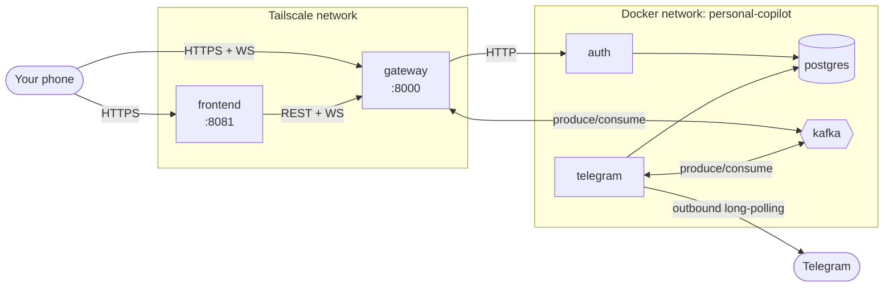
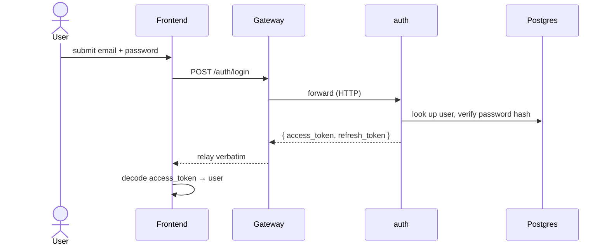
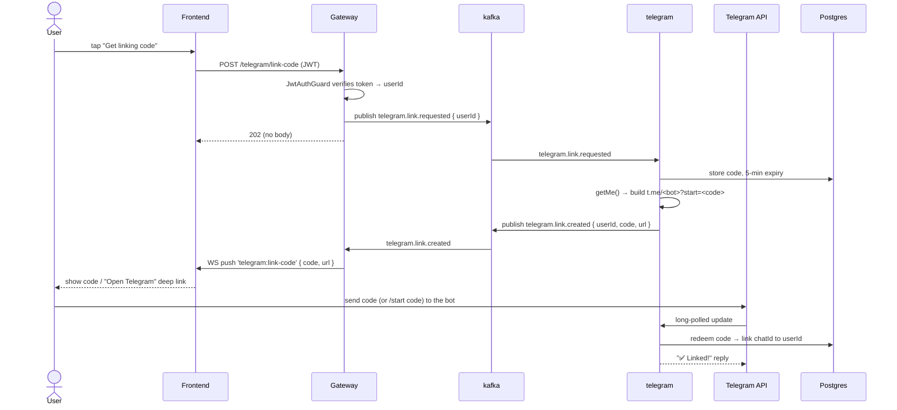

# Architecture

How the pieces in `docs/specs/services.md` fit together — diagrams plus the compose/build wiring
that doesn't fit one. See `services.md` for the per-service contract and `event-schemas.md` for the
Kafka contract.

## System topology

Only `gateway` and `frontend` are reachable from outside the Docker network (over Tailscale).
`auth` and `telegram` are internal-only — `telegram` has **no HTTP surface at all**, not even for
Gateway: everything it does (long-polling Telegram, the link-code round trip, message
send/receive) is outbound or via Kafka, so it needs no published port and no webhook. Gateway
itself is Kafka's newest producer/consumer (link-code request/reply, see the flow below); it's
still the only service with an inbound HTTP surface reachable from outside the Tailnet. Gateway's
WS (`/ws`) authenticates connections and can push to a specific user
(`IRealtimeConnectionService.pushToUser`) — the link-code flow is its first real use; no other
feature sends anything over it yet.

## Flow: register / login

## Flow: link a Telegram chat

Entirely async end to end — the HTTP call only enqueues the request, and the code comes back over
WS, not in an HTTP response:

If the user's WS connection is closed when `telegram.link.created` arrives, Gateway's
`pushToUser` just returns `false` — the code exists (it's usable for its full 5 minutes), it just
never reached that browser tab; the user has to tap "Get linking code" again.

## Compose & build layout

`devops/docker-compose.yml` only lists what to `include:` (one `devops/<unit>/docker-compose.yml`
per service — `gateway`, `auth`, `telegram`, `frontend`, `postgres`, `kafka` today) plus the shared
`networks:`.
Adding a service means a new Dockerfile under `backend/apps/<service>/` (or `frontend/`), a new
`devops/<service>/docker-compose.yml`, and one more `include:` line — see
`.claude/agents/devops.md` for the full shape.

Restart policy, logging, and `env_file` live once in `devops/common.yml`'s `_defaults` service,
applied per-service via `extends:` (YAML anchors don't resolve across the split files, so that's not
an option here). `networks:` stays out of `common.yml` and per-service instead, since `gateway`
needs `[personal-copilot, observability]` and every other service needs just `[personal-copilot]`.
Two `env_file` layers apply in order: `backend/.env` (local-dev defaults, the shared base) then
`devops/docker.env` (container-network overrides) — later entries win.

`devops/docker-compose.yml`'s `observability` network is declared `external: true` — the telemetry
stack (`devops/observability/`) owns it and must already be running, or `docker compose up` here
fails outright ("network observability not found"). See root `CLAUDE.md`'s "First run" for the
required startup order.

**Frontend build**: `frontend/Dockerfile` builds only the static web export (served by Caddy) —
Android/iOS have no useful container target and still run via `npx expo start` locally.
`GATEWAY_PUBLIC_URL` must reach it as a Docker build `ARG` (`devops/frontend/docker-compose.yml`),
never a runtime container env var — Expo inlines `EXPO_PUBLIC_*` vars into the client bundle at
build time, so a runtime-only value would silently never reach the client. No Telegram-specific
build arg is needed — `apps/telegram` builds its own deep link server-side (see `services.md
#telegram`), so the frontend never needs to know the bot's username.

**Kafka**: `apache/kafka` image, KRaft mode (no Zookeeper), pinned version, single node. `PLAINTEXT`
(19092) serves other containers, `PLAINTEXT_HOST` (9092) is published for local debugging (`kcat`,
etc.). `CLUSTER_ID` is a pinned, arbitrary UUID that must never change once `devops/data/kafka` has
formatted storage — a regenerated ID on restart mismatches the existing volume and the broker fails
to start. `KAFKA_AUTO_CREATE_TOPICS_ENABLE=false`, so every topic is created explicitly by the
`kafka-init` service (runs once, creates what's in `topics.ts`, exits) rather than auto-creating —
a topic missing from `kafka-init` fails loudly at first produce/consume instead of silently
appearing.

**Telegram**: `apps/telegram` has no HTTP surface at all — outbound long-polling to Telegram, and
both the link-code round trip and message send/receive over Kafka — so its compose service needs
no `ports:` and no `depends_on` from Gateway either; the two are fully decoupled by the broker. It
does depend on both `kafka` and `postgres` being healthy itself — the `telegram_links`/
`telegram_link_codes` tables live in the same shared Postgres instance as `auth`'s. `apps/gateway`,
in turn, now depends on `kafka` being healthy too, for the same request/reply.
