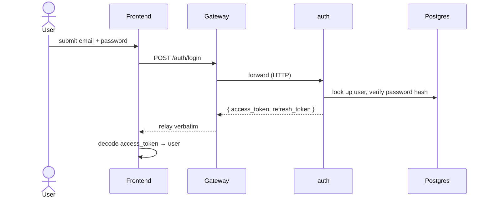

# Architecture

How the pieces in `docs/specs/services.md` fit together. This file is diagrams; see `services.md`
for the per-service contract and `event-schemas.md` for the (currently empty) Kafka contract.

## System topology

Only `gateway` and `frontend` are reachable from outside the Docker network (over Tailscale).
`auth` is internal-only. `kafka` runs as generic plumbing — nothing produces or consumes yet.
Gateway's WS (`/ws`) authenticates connections and can push to a specific user
(`IRealtimeConnectionService.pushToUser`), but no feature sends anything over it yet either.

## Flow: register / login

