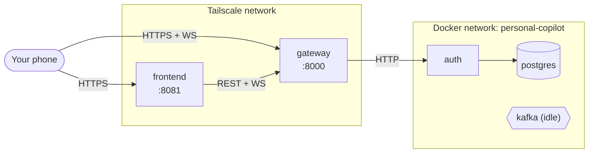
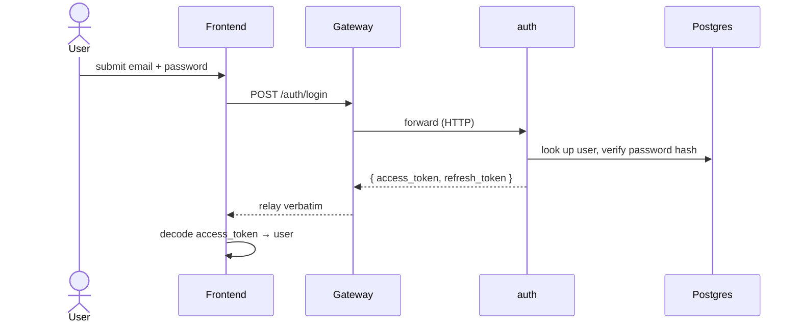

# Architecture

How the pieces in `docs/specs/services.md` fit together — diagrams plus the compose/build wiring
that doesn't fit one. See `services.md` for the per-service contract and `event-schemas.md` for the
(currently empty) Kafka contract.

## System topology

Only `gateway` and `frontend` are reachable from outside the Docker network (over Tailscale).
`auth` is internal-only. `kafka` runs as generic plumbing — nothing produces or consumes yet.
Gateway's WS (`/ws`) authenticates connections and can push to a specific user
(`IRealtimeConnectionService.pushToUser`), but no feature sends anything over it yet either.

## Flow: register / login

## Compose & build layout

`devops/docker-compose.yml` only lists what to `include:` (one `devops/<unit>/docker-compose.yml`
per service — `gateway`, `auth`, `frontend`, `postgres`, `kafka` today) plus the shared `networks:`.
Adding a service means a new Dockerfile under `backend/apps/<service>/` (or `frontend/`), a new
`devops/<service>/docker-compose.yml`, and one more `include:` line — see
`.claude/agents/devops.md` for the full shape.

Restart policy, logging, and `env_file` live once in `devops/common.yml`'s `_defaults` service,
applied per-service via `extends:` (YAML anchors don't resolve across the split files, so that's not
an option here). `networks:` stays out of `common.yml` and per-service instead, since `gateway`
needs `[personal-copilot, observability]` and every other service needs just `[personal-copilot]`.
Two `env_file` layers apply in order: `backend/.env` (local-dev defaults, the shared base) then
`devops/docker.env` (container-network overrides) — later entries win.

`devops/docker-compose.yml`'s `observability` network is declared `external: true` — the telemetry
stack (`devops/observability/`) owns it and must already be running, or `docker compose up` here
fails outright ("network observability not found"). See root `CLAUDE.md`'s "First run" for the
required startup order.

**Frontend build**: `frontend/Dockerfile` builds only the static web export (served by Caddy) —
Android/iOS have no useful container target and still run via `npx expo start` locally.
`GATEWAY_PUBLIC_URL` must reach it as a Docker build `ARG` (`devops/frontend/docker-compose.yml`),
never a runtime container env var — Expo inlines `EXPO_PUBLIC_*` vars into the client bundle at
build time, so a runtime-only value would silently never reach the client.

**Kafka**: `apache/kafka` image, KRaft mode (no Zookeeper), pinned version, single node. `PLAINTEXT`
(19092) serves other containers, `PLAINTEXT_HOST` (9092) is published for local debugging (`kcat`,
etc.). `CLUSTER_ID` is a pinned, arbitrary UUID that must never change once `devops/data/kafka` has
formatted storage — a regenerated ID on restart mismatches the existing volume and the broker fails
to start. Runs as unused generic plumbing (`KAFKA_AUTO_CREATE_TOPICS_ENABLE=false`, so a missing
topic fails loudly at first use instead of silently auto-creating) until a feature's first
producer/consumer needs it.
