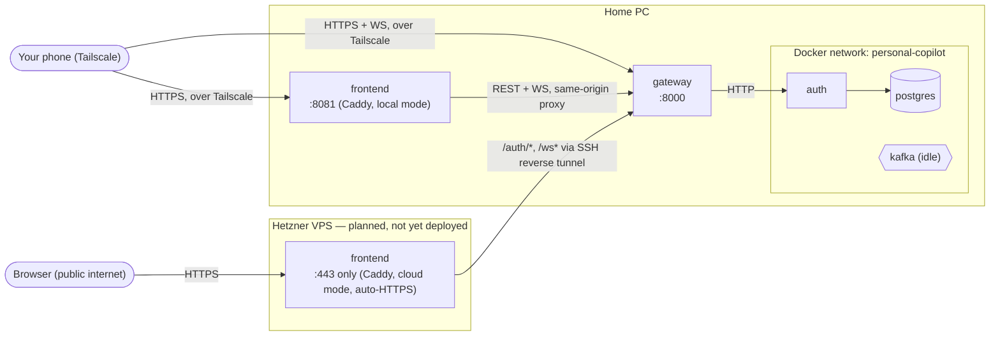
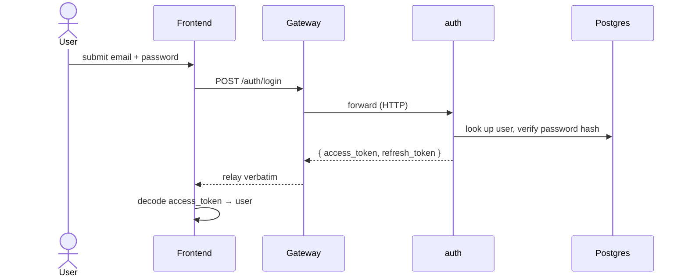

# Architecture

How the pieces in `docs/specs/services.md` fit together — diagrams plus the compose/build wiring
that doesn't fit one. See `services.md` for the per-service contract and `event-schemas.md` for the
(currently empty) Kafka contract.

## System topology

Two access paths exist to reach Gateway. The Tailscale path is what actually runs today. The
cloud/Hetzner path is code that's in place on this branch (Gateway's rate limiting, `trust proxy`
handling, `frontend/Caddyfile`'s proxy blocks, `devops/frontend/docker-compose.cloud.yml`) to
support a planned deployment — the VPS itself isn't provisioned or live. Both are valid at once:
nothing about the Tailscale path changes, since `frontend/Caddyfile`'s `{$GATEWAY_UPSTREAM}` and
`{$SITE_ADDRESS}` placeholders default to exactly today's local behavior and are only overridden by
`docker-compose.cloud.yml`'s own env.



Only `gateway` and `frontend` are reachable from outside the Docker network. Over Tailscale,
`frontend` is a container on the same Docker host as `gateway`; in the cloud path, `frontend`
(Caddy) instead runs standalone on the VPS and reaches `gateway` only via an SSH reverse tunnel
from the home machine (see "SSH reverse-tunnel hardening" below) — `gateway` itself is never given
a public port either way. `auth` is internal-only. `kafka` runs as generic plumbing — nothing
produces or consumes yet. Gateway's WS (`/ws`) authenticates connections and can push to a specific
user (`IRealtimeConnectionService.pushToUser`), but no feature sends anything over it yet either.

Gateway rate-limits globally (`@nestjs/throttler`, `THROTTLE_TTL_MS`/`THROTTLE_LIMIT`) plus a
tighter per-route limit on `/auth/register`, `/auth/login`, `/auth/refresh`
(`AUTH_THROTTLE_TTL_MS`/`AUTH_THROTTLE_LIMIT`) — see `docs/specs/services.md#gateway`. The limiter
keys on client IP, so Gateway's `main.ts` sets `app.set('trust proxy', 'loopback')`: it trusts
`X-Forwarded-For` only when the connection reaches it *from* loopback. In the cloud path that's
exactly the SSH tunnel's local end (Caddy → tunnel → Gateway all resolve to loopback hops on the
way in), so the limiter sees the real client IP Caddy forwarded. A connection reaching Gateway any
other way — e.g. directly over Tailscale — doesn't arrive from loopback, so `trust proxy` is
ignored for it and it can't spoof its IP by sending its own `X-Forwarded-For`.

## SSH reverse-tunnel hardening (Hetzner deployment)

Applies to the VPS's `sshd`. The home machine always initiates the connection outbound
(`ssh -R <GATEWAY_TUNNEL_PORT>:localhost:8000 <tunnel-user>@<vps>`, matching
`devops/frontend/.env.cloud.example`'s `GATEWAY_TUNNEL_PORT`), so the VPS is the server side of
this session and the side whose `sshd_config`/`authorized_keys` governs what the tunnel is allowed
to do. This is config to apply directly on the VPS, not something enforced by anything in this
repo.

- Use a dedicated SSH user and key for the tunnel only — not the operator's normal login key.
- Restrict that key's `authorized_keys` entry (or an equivalent `Match User <tunnel-user>` block in
  `sshd_config`):
  ```
  permitlisten="127.0.0.1:8000",permitopen="none",no-pty,no-X11-forwarding,no-agent-forwarding ssh-ed25519 AAAA...
  ```
  - `permitlisten="127.0.0.1:<port>"` is the directive that actually scopes a `-R` remote forward —
    it restricts which port this key can ask `sshd` to bind on the VPS to just Gateway's tunnel
    port. (`PermitOpen`/`permitopen` scopes `-L`/`-D` *local* forwarding's destination and has no
    effect on `-R`; set it to `"none"` alongside `permitlisten` so this key can't also be used to
    open a local/dynamic forward to something else on the VPS's own network.)
  - `no-pty,no-X11-forwarding,no-agent-forwarding` — the key can do nothing but the one forward: no
    shell, no X11, no agent access.
- `GatewayPorts no` (the `sshd` default — don't override it) is what keeps the forwarded port
  loopback-only on the VPS, reachable only by Caddy running on that same box, never directly from
  the open internet.

## Flow: register / login



## Compose & build layout

`devops/docker-compose.yml` only lists what to `include:` (one `devops/<unit>/docker-compose.yml`
per service — `gateway`, `auth`, `frontend`, `postgres`, `kafka` today) plus the shared `networks:`.
Adding a service means a new Dockerfile under `backend/apps/<service>/` (or `frontend/`), a new
`devops/<service>/docker-compose.yml`, and one more `include:` line — see
`.claude/agents/devops.md` for the full shape.

Restart policy, logging, and `env_file` live once in `devops/common.yml`'s `_defaults` service,
applied per-service via `extends:` (YAML anchors don't resolve across the split files, so that's not
an option here). `networks:` stays out of `common.yml` and per-service instead, since `gateway`
needs `[personal-copilot, observability]` and every other service needs just `[personal-copilot]`.
Two `env_file` layers apply in order: `backend/.env` (local-dev defaults, the shared base) then
`devops/docker.env` (container-network overrides) — later entries win.

`devops/docker-compose.yml`'s `observability` network is declared `external: true` — the telemetry
stack (`devops/observability/`) owns it and must already be running, or `docker compose up` here
fails outright ("network observability not found"). See root `CLAUDE.md`'s "First run" for the
required startup order.

**Frontend build**: `frontend/Dockerfile` builds only the static web export (served by Caddy) —
Android/iOS have no useful container target and still run via `npx expo start` locally.
`GATEWAY_PUBLIC_URL` must reach it as a Docker build `ARG` (`devops/frontend/docker-compose.yml`),
never a runtime container env var — Expo inlines `EXPO_PUBLIC_*` vars into the client bundle at
build time, so a runtime-only value would silently never reach the client.

**Cloud frontend (Hetzner)**: `devops/frontend/docker-compose.cloud.yml` is a standalone compose
file, not part of `devops/docker-compose.yml`'s `include:` list and not deployed by the "First run"
sequence — it's built and run independently on the VPS itself (`devops/frontend/.env.cloud.example`
→ `.env.cloud`). `DOMAIN` feeds both `GATEWAY_PUBLIC_URL` (build arg, same as above) and
`SITE_ADDRESS` (runtime, flips `frontend/Caddyfile` into automatic Let's Encrypt HTTPS instead of
plain `:80`). `network_mode: host` so Caddy can reach the SSH tunnel's loopback port on that VPS;
`GATEWAY_TUNNEL_PORT` feeds `GATEWAY_UPSTREAM=127.0.0.1:<port>`. A persistent `caddy-data` volume
holds the issued certificate.

**Kafka**: `apache/kafka` image, KRaft mode (no Zookeeper), pinned version, single node. `PLAINTEXT`
(19092) serves other containers, `PLAINTEXT_HOST` (9092) is published for local debugging (`kcat`,
etc.). `CLUSTER_ID` is a pinned, arbitrary UUID that must never change once `devops/data/kafka` has
formatted storage — a regenerated ID on restart mismatches the existing volume and the broker fails
to start. Runs as unused generic plumbing (`KAFKA_AUTO_CREATE_TOPICS_ENABLE=false`, so a missing
topic fails loudly at first use instead of silently auto-creating) until a feature's first
producer/consumer needs it.
