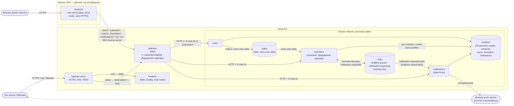
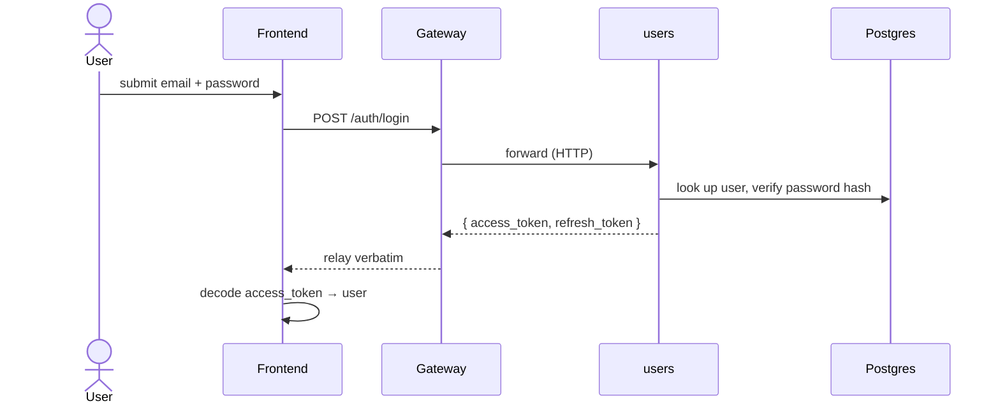
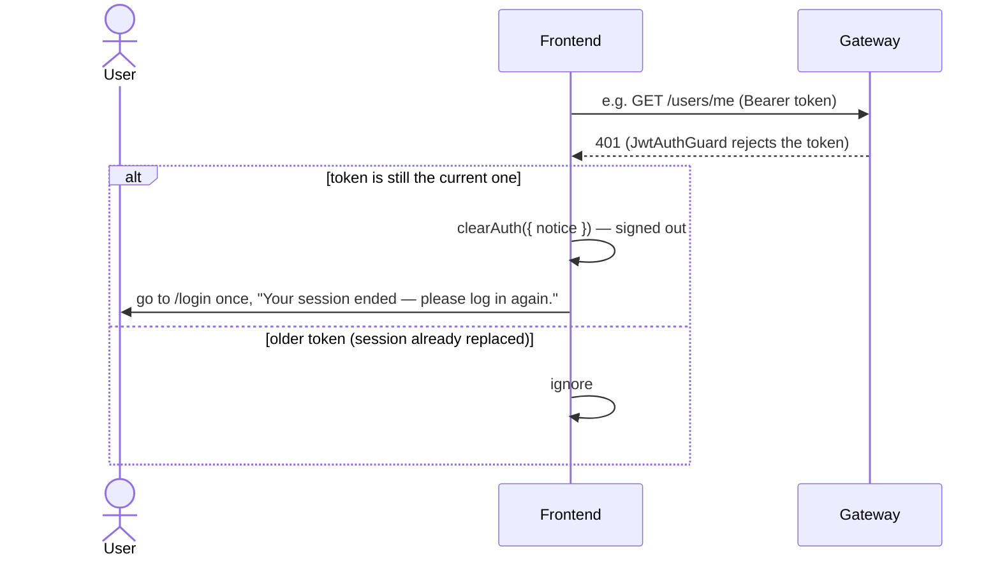
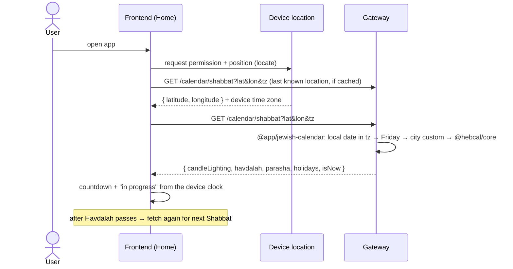
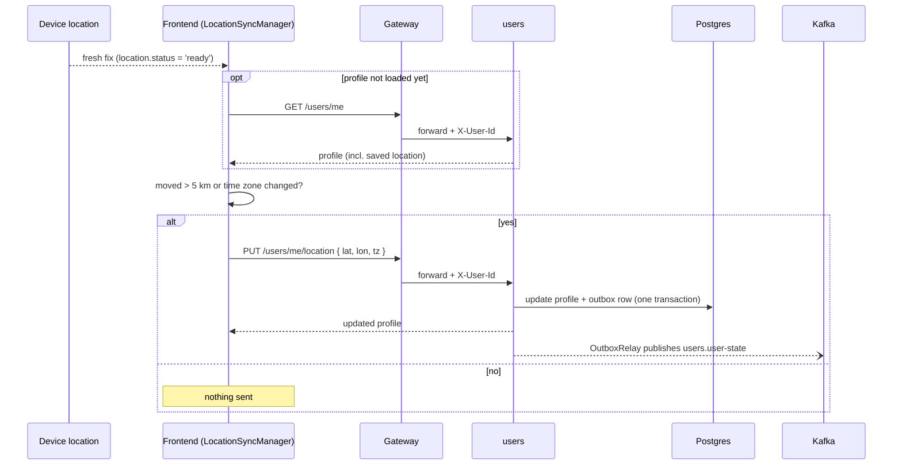
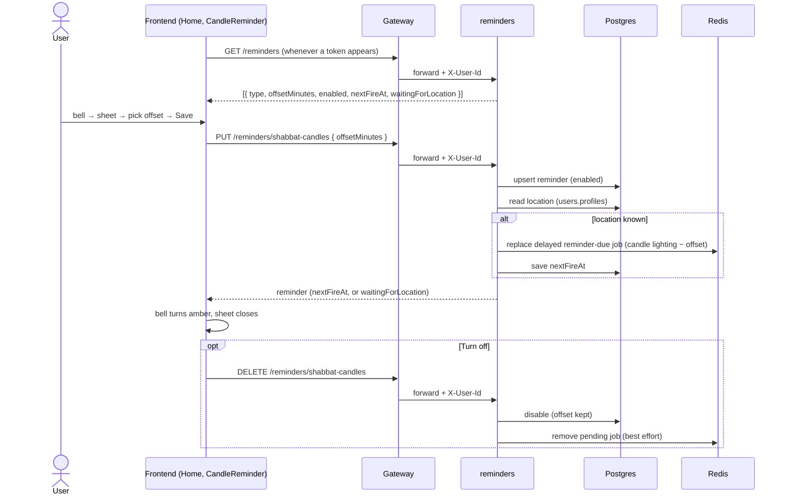

# Architecture

How the pieces in `docs/specs/services.md` fit together — diagrams plus the compose/build wiring
that doesn't fit one. See `services.md` for the per-service contract and `event-schemas.md` for the
queue/job contract.

## System topology

Two access paths exist to reach Gateway. The Tailscale path is what actually runs today. The
cloud/Hetzner path is code that's in place on this branch (Gateway's rate limiting, `trust proxy`
handling, `frontend/Caddyfile`'s proxy blocks, `devops/frontend/docker-compose.cloud.yml`) to
support a planned deployment — the VPS itself isn't provisioned or live. Both are valid at once:
nothing about the Tailscale path changes, since `frontend/Caddyfile`'s `{$GATEWAY_UPSTREAM}` and
`{$SITE_ADDRESS}` placeholders default to exactly today's local behavior and are only overridden by
`docker-compose.cloud.yml`'s own env.


```mermaid
flowchart LR
    Phone(["Your phone (Tailscale)"])
    Browser(["Browser (public internet)"])

    subgraph Home["Home PC"]
        TsServe["tailscale serve\nHTTPS :443 / :8443"]
        Gateway["gateway\n:8000\n(+ /calendar/shabbat, @app/jewish-calendar)"]
        FrontendLocal["frontend\n:8081 (Caddy, local mode)"]
        subgraph Docker["Docker network: personal-copilot"]
            Users["users"]
            Reminders["reminders\n(scheduler, @app/jewish-calendar)"]
            Notifications["notifications\n(Web Push)"]
            Postgres[("postgres\nDB personal_copilot, schemas:\nusers, reminders, notifications")]
            Redis[("redis\nBullMQ queues: notification-requested,\nreminder-due")]
            Kafka[("kafka\ntopic: users.user-state")]
        end
    end

    subgraph VPS["Hetzner VPS — planned, not yet deployed"]
        CaddyCloud["frontend\n:443 only (Caddy, cloud mode, auto-HTTPS)"]
    end

    Phone -->|HTTPS, over Tailscale| TsServe
    TsServe -->|":443 → :8081"| FrontendLocal
    TsServe -->|":8443 → :8000 (REST + WS)"| Gateway

    Browser -->|HTTPS| CaddyCloud
    CaddyCloud -->|"/auth/*, /calendar/*, /users/*, /reminders*, /notifications/*, /ws* via SSH reverse tunnel"| Gateway

    Gateway -->|"HTTP (+ X-User-Id on /users/me*)"| Users
    Gateway -->|"HTTP + X-User-Id"| Reminders
    Gateway -->|"HTTP + X-User-Id"| Notifications
    Users --> Postgres
    Users -->|"outbox: users.user-state"| Kafka
    Reminders -->|"own schema + reads users.profiles"| Postgres
    Kafka -->|"users.user-state"| Reminders
    Reminders <-->|"reminder-due jobs;\nnotification-requested"| Redis
    Notifications --> Postgres
    Redis -->|"notification-requested jobs\n(progress saved back)"| Notifications
    Notifications -->|"encrypted push"| PushSvc(["Browser push service\n(FCM for Chrome/Brave)"])
    PushSvc -.-> Phone
```

Only `gateway` and `frontend` are reachable from outside the Docker network. Over Tailscale,
`frontend` is a container on the same Docker host as `gateway`, and `tailscale serve`
(`devops/tailscale/serve.sh`) puts both behind HTTPS with the machine's `*.ts.net` certificate —
required because phone browsers only allow GPS on HTTPS pages. The frontend build calls Gateway at
that HTTPS `:8443` address directly (`GATEWAY_PUBLIC_URL`), not through the local Caddy. Expo Go /
native builds don't need HTTPS and can call Gateway at the PC's tailnet IP on `:8000`; in the cloud path, `frontend`
(Caddy) instead runs standalone on the VPS and reaches `gateway` only via an SSH reverse tunnel
from the home machine (see "SSH reverse-tunnel hardening" below) — `gateway` itself is never given
a public port either way. `users`, `reminders`, and `notifications` are
internal-only; `users` publishes every profile change to Kafka (`users.user-state`, through
its outbox; Reminders consumes it); `reminders` stores per-user reminders and fires them as delayed
BullMQ jobs, publishing `notification-requested`. All calendar maths is the in-process
`@app/jewish-calendar` library, used by Reminders and by Gateway, which serves Home's
`GET /calendar/shabbat` itself (its one non-proxy route);
`notifications` stores browsers' Web Push subscriptions and processes `notification-requested`
jobs from Redis (BullMQ), sending each to every device the user has through that browser's push
service, end-to-end encrypted, and retrying the job for devices that weren't reached. Gateway's WS (`/ws`) authenticates connections and can push to a specific
user (`IRealtimeConnectionService.pushToUser`), but no feature sends anything over it yet either.

Gateway rate-limits globally (`@nestjs/throttler`, `THROTTLE_TTL_MS`/`THROTTLE_LIMIT`) plus a
tighter per-route limit on `/auth/register`, `/auth/login`, `/auth/refresh`, `/auth/account`
(`AUTH_THROTTLE_TTL_MS`/`AUTH_THROTTLE_LIMIT`) — see `docs/specs/services.md#gateway`. The limiter
keys on client IP, so Gateway's `main.ts` sets `app.set('trust proxy', 'loopback')`: it trusts
`X-Forwarded-For` only when the connection reaches it *from* loopback. In the cloud path that's
exactly the SSH tunnel's local end (Caddy → tunnel → Gateway all resolve to loopback hops on the
way in), so the limiter sees the real client IP Caddy forwarded. A connection reaching Gateway any
other way — e.g. directly over Tailscale — doesn't arrive from loopback, so `trust proxy` is
ignored for it and it can't spoof its IP by sending its own `X-Forwarded-For`.

## SSH reverse-tunnel hardening (Hetzner deployment)

Applies to the VPS's `sshd`. The home machine always initiates the connection outbound
(`ssh -R <GATEWAY_TUNNEL_PORT>:localhost:8000 <tunnel-user>@<vps>`, matching
`devops/frontend/.env.cloud.example`'s `GATEWAY_TUNNEL_PORT`), so the VPS is the server side of
this session and the side whose `sshd_config`/`authorized_keys` governs what the tunnel is allowed
to do. This is config to apply directly on the VPS, not something enforced by anything in this
repo.

- Use a dedicated SSH user and key for the tunnel only — not the operator's normal login key.
- Restrict that key's `authorized_keys` entry (or an equivalent `Match User <tunnel-user>` block in
  `sshd_config`):
  ```
  permitlisten="127.0.0.1:8000",permitopen="none",no-pty,no-X11-forwarding,no-agent-forwarding ssh-ed25519 AAAA...
  ```
  - `permitlisten="127.0.0.1:<port>"` is the directive that actually scopes a `-R` remote forward —
    it restricts which port this key can ask `sshd` to bind on the VPS to just Gateway's tunnel
    port. (`PermitOpen`/`permitopen` scopes `-L`/`-D` *local* forwarding's destination and has no
    effect on `-R`; set it to `"none"` alongside `permitlisten` so this key can't also be used to
    open a local/dynamic forward to something else on the VPS's own network.)
  - `no-pty,no-X11-forwarding,no-agent-forwarding` — the key can do nothing but the one forward: no
    shell, no X11, no agent access.
- `GatewayPorts no` (the `sshd` default — don't override it) is what keeps the forwarded port
  loopback-only on the VPS, reachable only by Caddy running on that same box, never directly from
  the open internet.

## Flow: register / login


```mermaid
sequenceDiagram
    actor User
    participant Frontend
    participant Gateway
    participant Users as users
    participant DB as Postgres

    User->>Frontend: submit email + password
    Frontend->>Gateway: POST /auth/login
    Gateway->>Users: forward (HTTP)
    Users->>DB: look up user, verify password hash
    Users-->>Gateway: { access_token, refresh_token }
    Gateway-->>Frontend: relay verbatim
    Frontend->>Frontend: decode access_token → user
```

## Flow: session rejected by the server (signed in)

Any signed-in call; see `services.md#frontend`'s "Session ended".


```mermaid
sequenceDiagram
    actor User
    participant Frontend
    participant Gateway

    Frontend->>Gateway: e.g. GET /users/me (Bearer token)
    Gateway-->>Frontend: 401 (JwtAuthGuard rejects the token)
    alt token is still the current one
        Frontend->>Frontend: clearAuth({ notice }) — signed out
        Frontend->>User: go to /login once, "Your session ended — please log in again."
    else older token (session already replaced)
        Frontend->>Frontend: ignore
    end
```

## Flow: Shabbat times on Home


```mermaid
sequenceDiagram
    actor User
    participant App as Frontend (Home)
    participant GPS as Device location
    participant Gateway

    User->>App: open app
    App->>GPS: request permission + position (locate)
    App->>Gateway: GET /calendar/shabbat?lat&lon&tz (last known location, if cached)
    GPS-->>App: { latitude, longitude } + device time zone
    App->>Gateway: GET /calendar/shabbat?lat&lon&tz
    Gateway->>Gateway: @app/jewish-calendar: local date in tz → Friday → city custom → @hebcal/core
    Gateway-->>App: { candleLighting, havdalah, parasha, holidays, isNow }
    App->>App: countdown + "in progress" from the device clock
    Note over App: after Havdalah passes → fetch again for next Shabbat
```

## Flow: location sync (signed in)


```mermaid
sequenceDiagram
    participant GPS as Device location
    participant App as Frontend (LocationSyncManager)
    participant Gateway
    participant Users as users
    participant DB as Postgres
    participant Kafka

    GPS-->>App: fresh fix (location.status = 'ready')
    opt profile not loaded yet
        App->>Gateway: GET /users/me
        Gateway->>Users: forward + X-User-Id
        Users-->>App: profile (incl. saved location)
    end
    App->>App: moved > 5 km or time zone changed?
    alt yes
        App->>Gateway: PUT /users/me/location { lat, lon, tz }
        Gateway->>Users: forward + X-User-Id
        Users->>DB: update profile + outbox row (one transaction)
        Users-->>App: updated profile
        Users--)Kafka: OutboxRelay publishes users.user-state
    else no
        Note over App: nothing sent
    end
```

## Flow: setting the candle-lighting reminder (signed in)

Delivery once it fires: `docs/specs/notification-flow.md`.


```mermaid
sequenceDiagram
    actor User
    participant App as Frontend (Home, CandleReminder)
    participant Gateway
    participant Rem as reminders
    participant DB as Postgres
    participant Redis

    App->>Gateway: GET /reminders (whenever a token appears)
    Gateway->>Rem: forward + X-User-Id
    Rem-->>App: [{ type, offsetMinutes, enabled, nextFireAt, waitingForLocation }]
    User->>App: bell → sheet → pick offset → Save
    App->>Gateway: PUT /reminders/shabbat-candles { offsetMinutes }
    Gateway->>Rem: forward + X-User-Id
    Rem->>DB: upsert reminder (enabled)
    Rem->>DB: read location (users.profiles)
    alt location known
        Rem->>Redis: replace delayed reminder-due job (candle lighting − offset)
        Rem->>DB: save nextFireAt
    end
    Rem-->>App: reminder (nextFireAt, or waitingForLocation)
    App->>App: bell turns amber, sheet closes
    opt Turn off
        App->>Gateway: DELETE /reminders/shabbat-candles
        Gateway->>Rem: forward + X-User-Id
        Rem->>DB: disable (offset kept)
        Rem->>Redis: remove pending job (best effort)
    end
```

## Compose & build layout

`devops/docker-compose.yml` only lists what to `include:` (one `devops/<unit>/docker-compose.yml`
per service — `gateway`, `users`, `reminders`, `notifications`, `frontend`, `postgres`,
`redis`, `kafka` today) plus the shared `networks:`.
Adding a service means a new Dockerfile under `backend/apps/<service>/` (or `frontend/`), a new
`devops/<service>/docker-compose.yml`, and one more `include:` line — see
`.claude/agents/devops.md` for the full shape.

Restart policy, logging, and `env_file` live once in `devops/common.yml`'s `_defaults` service,
applied per-service via `extends:` (YAML anchors don't resolve across the split files, so that's not
an option here). `networks:` stays out of `common.yml` and per-service instead, since the Nest services need
`[personal-copilot, observability]` (they export telemetry) while `frontend`, `postgres`,
`redis` and `kafka` need just `[personal-copilot]`.
Two `env_file` layers apply in order: `backend/.env` (local-dev defaults, the shared base) then
`devops/docker.env` (container-network overrides) — later entries win.

**Postgres**: one instance, one database (`personal_copilot`, `POSTGRES_DB`), one schema per
table-owning service — `users`, `reminders`, `notifications`. Every service connects with the same
`DATABASE_URL` and sets its own `schema`; it writes only that schema and may read another's tables
through a read-only TypeORM mapping (`synchronize: false`), e.g. Reminders reading
`users.profiles`. Ownership is a convention, not database roles. Tables that hold per-user data
reference `users.users(id)` `ON DELETE CASCADE`, so deleting an account removes them in the same
transaction — which is why `reminders` and `notifications` wait for `users` to be healthy (its
tables must exist first). `devops/postgres`'s `postgres-init` is a one-shot container that creates
any missing schema on every `up` (idempotent; Postgres's own first-boot init scripts can't, once
`devops/data/postgres` exists). Adding a service with tables = add its schema there.

`devops/docker-compose.yml`'s `observability` network is declared `external: true` — the telemetry
stack (`devops/observability/`) owns it and must already be running, or `docker compose up` here
fails outright ("network observability not found"). See root `CLAUDE.md`'s "First run" for the
required startup order.

**Frontend build**: `frontend/Dockerfile` builds only the static web export (served by Caddy).
The Android app is built separately, not by compose: `node devops/android/apk.js build` builds
`devops/android/Dockerfile` (JDK 17, Android SDK command-line tools, Node 22) and runs `apk.js`
itself inside it (`devops/android` mounted read-only at `/tools`) over a read-only
`frontend/` mount, with Docker volumes caching the SDK (`pc-android-sdk`), Gradle
(`pc-android-gradle`) and npm, and the release key plus the built APKs in `devops/data/android/`.
It sets the same `EXPO_PUBLIC_*` values the web image does, from `devops/.env` and
`version/versions.json`. arm64 by default (`ANDROID_ABIS=arm64-v8a,x86_64` → an `-emulator` APK).
`node devops/android/apk.js publish` copies a built APK into `devops/data/apk/` — directly, or via
a `node:22-alpine` container when that folder is root-owned — which `frontend`'s Caddy serves at
`/apk/` (local mode only — see `frontend/README.md`).
`GATEWAY_PUBLIC_URL` must reach it as a Docker build `ARG` (`devops/frontend/docker-compose.yml`),
never a runtime container env var — Expo inlines `EXPO_PUBLIC_*` vars into the client bundle at
build time, so a runtime-only value would silently never reach the client.

**Version build context**: every image's `build:` (the four backend services, `frontend`, and
`docker-compose.cloud.yml`) adds `additional_contexts: version: ../../version` — just the repo's
`version/` folder, not the whole repo as context. Each backend Dockerfile extracts only its own
entry in a separate `own-version` stage, so bumping one service's version leaves every other
image's layers — and its baked-in build time — cached. The frontend reads `app` and `frontend`
from it into `EXPO_PUBLIC_*` vars at build time. A standalone `docker build` must pass
`--build-context version=../version`. What the versions are and where they're shown:
`services.md#versions`.

**Cloud frontend (Hetzner)**: `devops/frontend/docker-compose.cloud.yml` is a standalone compose
file, not part of `devops/docker-compose.yml`'s `include:` list and not deployed by the "First run"
sequence — it's built and run independently on the VPS itself (`devops/frontend/.env.cloud.example`
→ `.env.cloud`). `DOMAIN` feeds both `GATEWAY_PUBLIC_URL` (build arg, same as above) and
`SITE_ADDRESS` (runtime, flips `frontend/Caddyfile` into automatic Let's Encrypt HTTPS instead of
plain `:80`). `network_mode: host` so Caddy can reach the SSH tunnel's loopback port on that VPS;
`GATEWAY_TUNNEL_PORT` feeds `GATEWAY_UPSTREAM=127.0.0.1:<port>`. A persistent `caddy-data` volume
holds the issued certificate.

**Redis**: `redis:7.4-alpine`, single node, holds only BullMQ queues (see `event-schemas.md`). Not
published to the host. AOF (`appendfsync everysec`) with RDB snapshots off, data in
`devops/data/redis`, so queued and delayed jobs survive a restart. `maxmemory 64mb` with
`noeviction`, which BullMQ requires: a full Redis rejects new jobs (the publisher gets an error)
instead of silently evicting queue keys. `notifications` waits on its healthcheck
(`service_healthy`). The opt-in Redis tests need a Redis of its own on the host
(`REDIS_IT_URL=redis://localhost:6379 npx jest notification-flow.it queue-roundtrip`), since this one isn't reachable
from outside Docker.

**Kafka**: `apache/kafka:4.3.1`, one node in KRaft mode (broker and controller in one, no
ZooKeeper), holds only events (see `event-schemas.md`). Not published to the host: it has no
authentication, and a published port would be reachable over Tailscale. One listener,
`kafka:19092` (`KAFKA_BROKERS` in `docker.env`). Data in `devops/data/kafka`, which must be owned by
the container's user or the broker crash-loops. `CLUSTER_ID` is fixed so the
existing data directory stays valid across recreations. Auto-create is off: the one-shot
`kafka-init` creates every topic in `KAFKA_TOPICS` (idempotent, 3 partitions each,
`users.user-state` compacted). The opt-in round-trip test needs a broker of its own on the host
(`KAFKA_IT_BROKERS=localhost:9092 npx jest kafka-roundtrip`).

