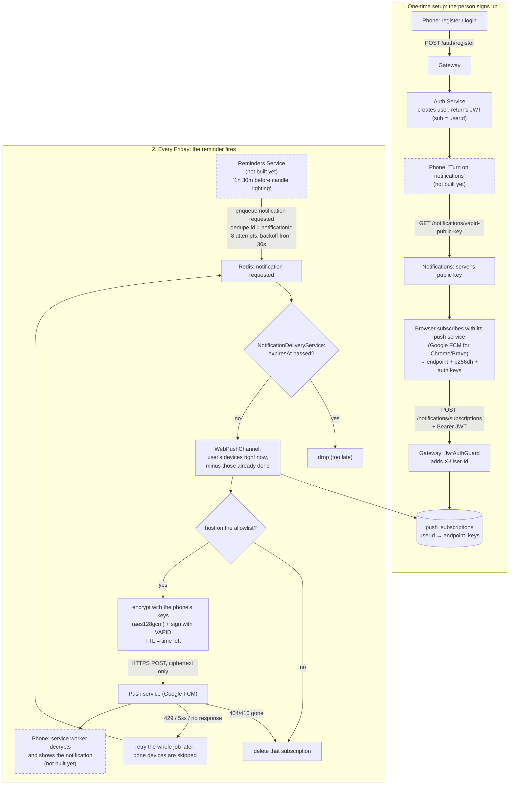

# Notification flow

How a person ends up with a Shabbat reminder on their phone: first they sign up and turn on
notifications (once), then every reminder travels a BullMQ queue → Notification Service → the
browser's push service → the phone. Dashed boxes are not built yet. For the exact rules of each
service see [services.md](services.md); for the job shapes see [event-schemas.md](event-schemas.md).



## 1. One-time setup

1. The person registers or logs in through Gateway; Auth Service returns a JWT whose `sub` is their
   user id.
2. The app asks for the server's VAPID public key (open route) and has the browser subscribe with
   its push service. The browser returns an `endpoint` URL plus two keys (`p256dh`, `auth`) that
   only it can decrypt with.
3. The app posts that subscription with its JWT. Gateway verifies the token and forwards only the
   user id, as `X-User-Id`; Notification Service stores the endpoint and keys against that user
   (only known push-service hosts are accepted).

## 2. Every reminder

1. Reminders enqueues one `notification-requested` job (`notificationId`, `userId`, title, body,
   `expiresAt`, …) with `notificationRequestedPublishOptions`: deduplicated on `notificationId`
   until `expiresAt`, up to 8 attempts with backoff doubling from 30 s.
2. Notification Service drops the job if `expiresAt` has passed (e.g. it was down past candle
   lighting). Otherwise `WebPushChannel` looks up the user's devices *as they are now* and skips
   any an earlier attempt of this job already finished.
3. For each remaining device: if its host is no longer allowed, the subscription is deleted and
   nothing sent. Otherwise the payload is encrypted with that browser's keys (RFC 8291,
   `aes128gcm`), signed with the server's VAPID key, and the ciphertext posted to the push service
   with a TTL of the time left until `expiresAt`. The push service sees timing and size, never the
   text.
4. The push service's answer, per device: sent → done; 404/410 → subscription deleted, done;
   429, 5xx or no response → not done; any other error → logged, done (retrying wouldn't help).
   Each "done" is saved in the job's progress straight away.
5. If any device wasn't done, the job fails and BullMQ retries it later (never past `expiresAt`).
   The retry reaches only the devices still missing — plus any the user added meanwhile, minus any
   removed or now signed in as someone else. A device can therefore, rarely, get the same
   notification twice (the push went out but the answer was lost); it never silently misses one to
   a transient error. Nothing about the notification is stored beyond its BullMQ job.
6. The push service forwards the ciphertext to the phone, whose service worker decrypts it and
   shows the notification.

Until the Reminders publisher exists, step 1 can be done by hand from `devops/` (replace the user
id with a registered user's `sub`):

```bash
docker compose exec notifications node -e "
const { Queue } = require('bullmq');
const q = new Queue('notification-requested', { connection: { host: 'redis', port: 6379 } });
const id = require('crypto').randomUUID(), now = Date.now(), ttl = 60 * 60 * 1000;
q.add('notification-requested', {
  notificationId: id, userId: '<user id>', title: 'Test', body: 'Hello from the queue',
  source: 'manual', requestedAt: new Date(now).toISOString(), expiresAt: new Date(now + ttl).toISOString(),
}, { deduplication: { id, ttl }, attempts: 8, backoff: { type: 'exponential', delay: 30000 } }).then(() => q.close());
"
```
